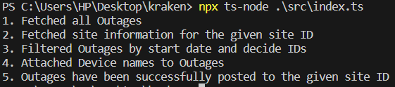
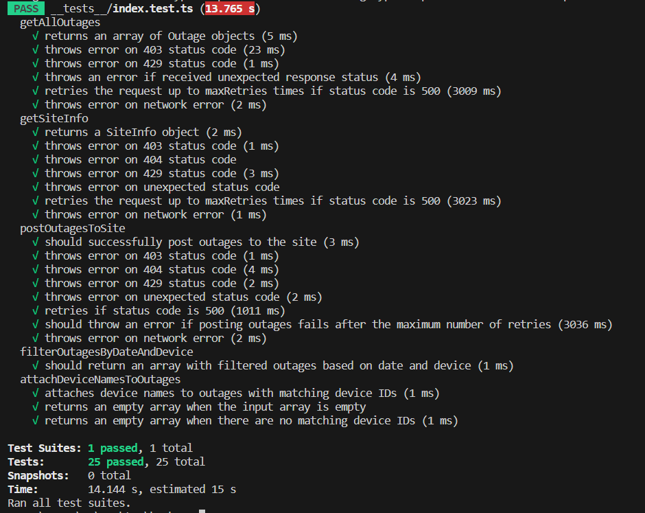

# Kraken Backend Engineer Test

## Introduction

This repository is a submission for the test assigned by KrakenFLex for the role of Backend Engineer. The details of the problem statement can be found [here](task_description/README.md)

## Prerequisite

- Node.js (version 12 or higher)
- npm (Node Package Manager)

## Installation

1. Clone the repository:

```shell
git clone https://github.com/Adityajain732/KrakenFlex-Backend-Test.git
```

2. Navigate to the project directory:

```shell
cd kraken
```

3. npm install

```shell
npm install
```

## Usage

To run the typescript program that solves the problem mentioned in the task description, we need to execute the `src/index.ts` file directly with Node.js

```shell
npx ts-node ./src/index.ts
```

With using `ts-node` in the above command, there is no need of an explicit compilation step as ts-node package executes typescript files on the fly. However, using `ts-node` is convenient during development and running independent scripts, but for production deployments, its recommended to precompile Typescript code to Javascript and then execute the generated javascript code.

The below Output should be obtained after running the above command



## Testing

To run the unit tests, use the following command:

```
npm test
```

This will execute the tests defined in the `__tests__/index.test.ts` file and display the test results.



I hope this solution solves the requirements. Please let me know if any step is unclear or you have any question. I have attached my contact details below:

Aditya Jain
adityajain.jain2798@gmail.com